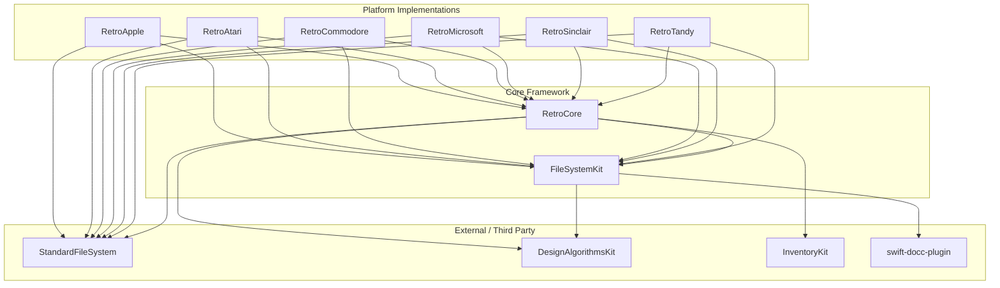
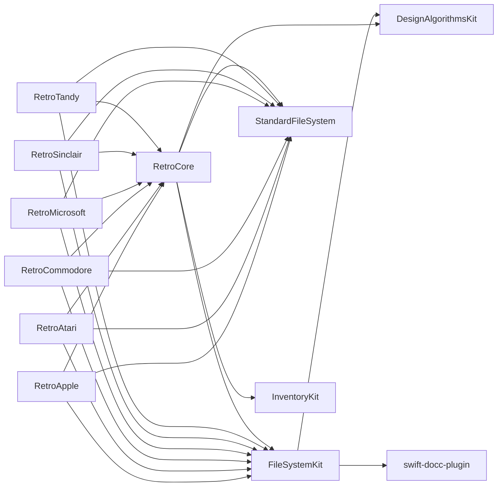
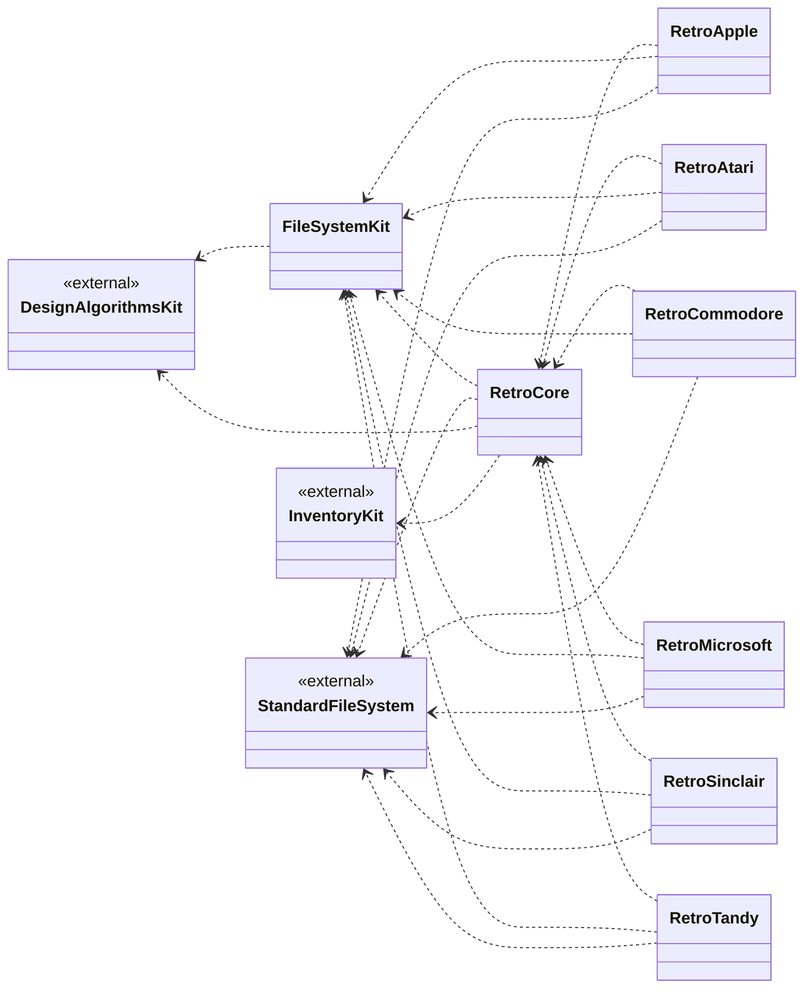

# Swift Package Dependency Graph

This document provides visualizers for the Swift package dependencies in the RetroShell repository.

## 1. Layered Architecture View

This view groups packages by their role (Implementations, Core, External), making it easier to see the architectural strata.

## 2. Dependency Network (Force Directed)

The strict dependency graph, useful for tracing specific import paths.

## 3. Class Diagram Association View

An alternative view using UML notation, which can be cleaner for dense graphs.

## Insights

- **FileSystemKit** is the foundational dependency used by almost everything.
- **RetroCore** serves as the shared logic layer for all platform implementations.
- **StandardFileSystem** acts as a bridge for standard FS operations across platforms.
