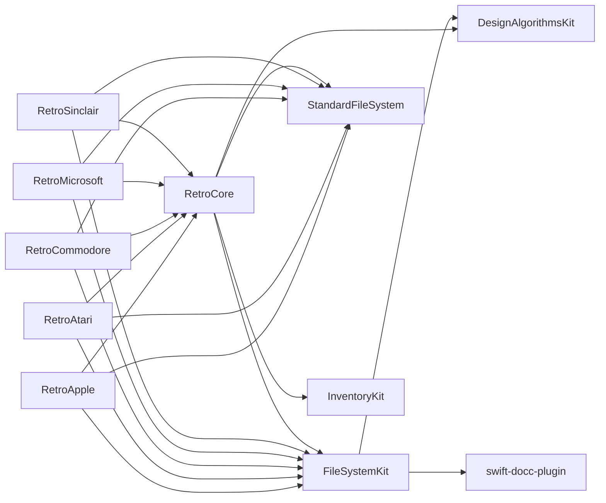

# Swift Package Dependency Graph

The following diagram visualizes how the **Swift packages** in the RetroShell repository depend on each other (and on external packages).
Each node represents a Swift package (either a submodule or an external dependency).
Arrows point from a package to the packages it **depends on**.

## How to read the diagram

- **Submodule packages** (`RetroApple`, `RetroAtari`, `RetroCommodore`, `RetroMicrosoft`, `RetroSinclair`, `RetroCore`, `FileSystemKit`) are the Swift packages defined in each submodule’s `Package.swift`.
- **External packages** (`StandardFileSystem`, `DesignAlgorithmsKit`, `InventoryKit`, `swift-docc-plugin`) are pulled from other repositories via URL or local path.
- An arrow `A --> B` means **package A** lists **package B** in its `dependencies` array.

## Why this matters

Understanding these relationships helps:

1. **Dependency management** – know which packages must be updated together.
2. **Build ordering** – ensure submodules are compiled after their dependencies.
3. **Impact analysis** – see how a change in one package (e.g., `FileSystemKit`) propagates to others.
