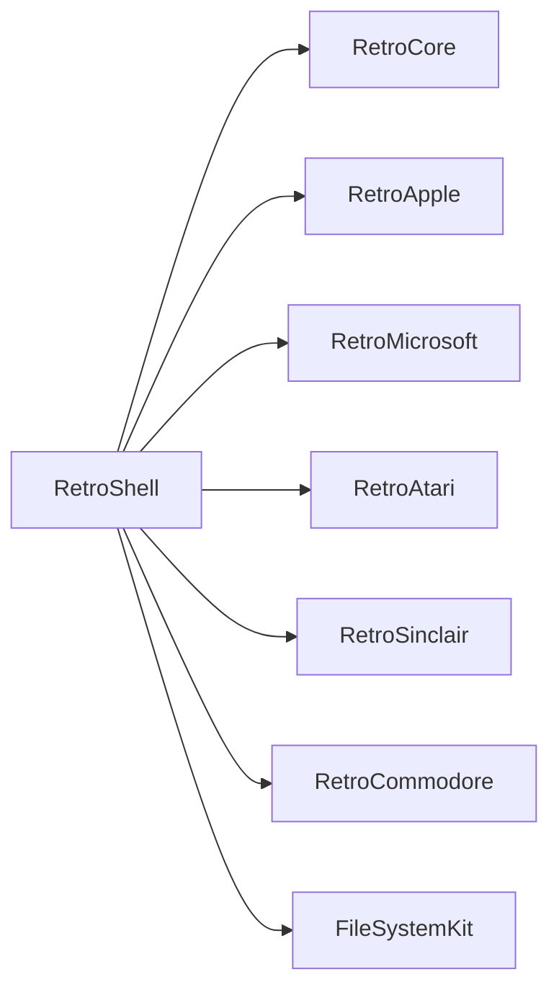

# Submodule Dependency Graph

```mermaid
flowchart LR
    RetroShell --> RetroCore
    RetroShell --> RetroApple
    RetroShell --> RetroMicrosoft
    RetroShell --> RetroAtari
    RetroShell --> RetroSinclair
    RetroShell --> RetroCommodore
    RetroShell --> FileSystemKit
```

This diagram visualizes the submodule relationships defined in `.gitmodules`.
